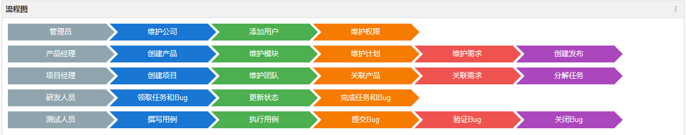

# 如何使用禅道

### 禅道项目管理软件是做什么的

国产开源项目管理软件。它集产品管理、项目管理、质量管理、文档管理、组织管理和事务管理于一体，是一款专业的研发项目管理软件，完整覆盖了研发项目管理的核心流程。禅道管理思想注重实效，功能完备丰富，操作简洁高效，界面美观大方，搜索功能强大，统计报表丰富多样，软件架构合理，扩展灵活，有完善的API可以调用。禅道，专注研发项目管理！

### 禅道项目管理软件的主要功能列表：

1. 产品管理：包括产品、需求、计划、发布、路线图等功能。
2. 项目管理：包括项目、任务、团队、版本、燃尽图等功能。
3. 质量管理：包括bug、测试用例、测试任务、测试结果等功能。
4. 文档管理：包括产品文档库、项目文档库、自定义文档库等功能。
5. 事务管理：包括todo管理，我的任务、我的Bug、我的需求、我的项目等个人事务管理功能。
6.  组织管理：包括部门、用户、分组、权限等功能。
7.  统计功能：丰富的统计表。
8.  搜索功能：强大的搜索，帮助您找到相应的数据。
9.  扩展机制，几乎可以对禅道的任何地方进行扩展。
10. api机制，所见皆API，方便与其他系统集成。

### 流程图

创建帐号、创建产品、创建需求、创建项目、管理团队、关联需求、创建任务、分解任务、提Bug。

